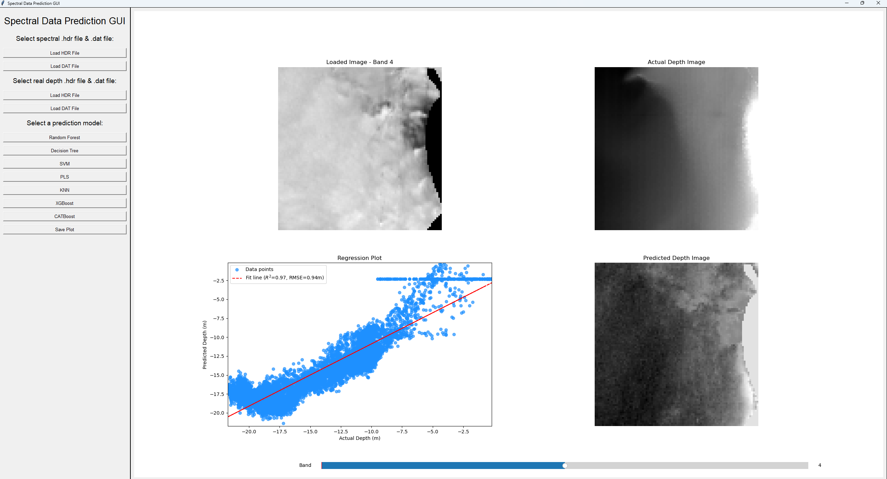
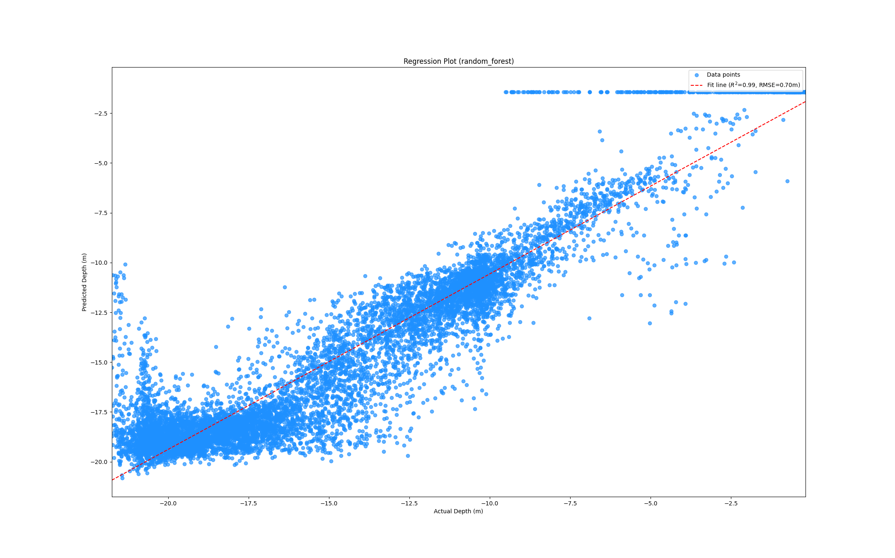
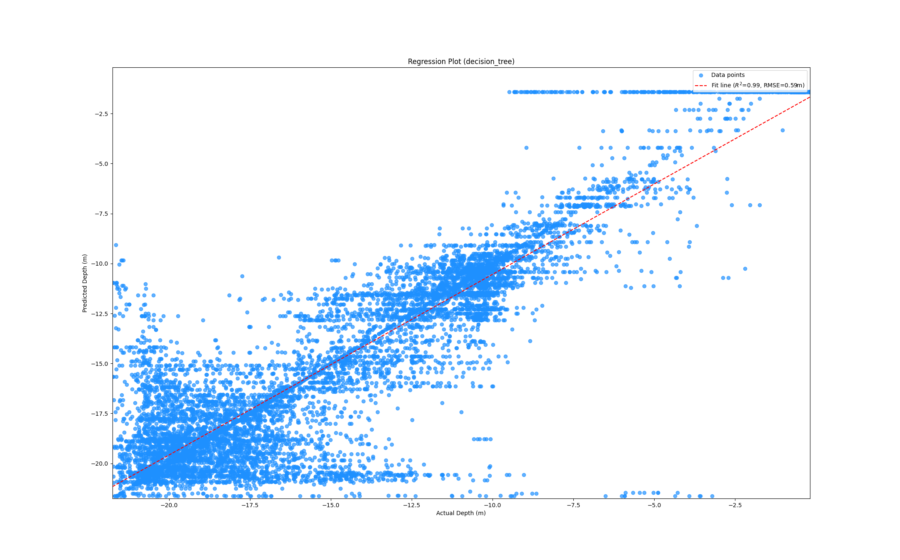
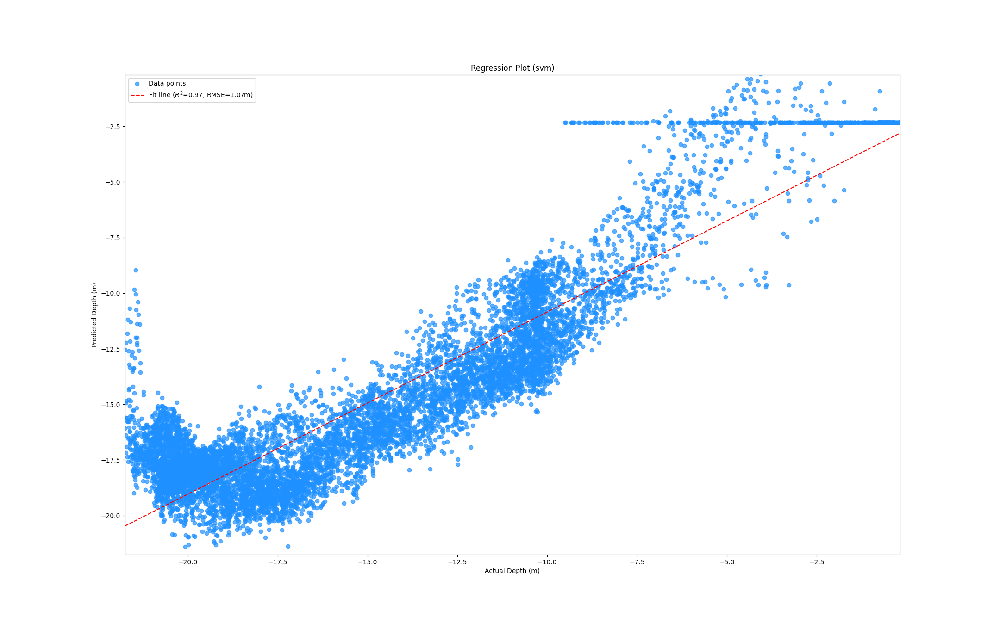
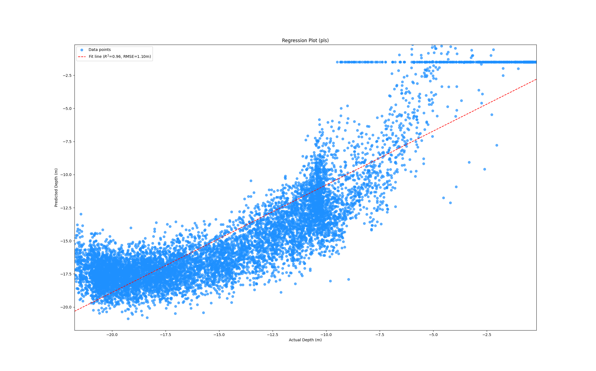
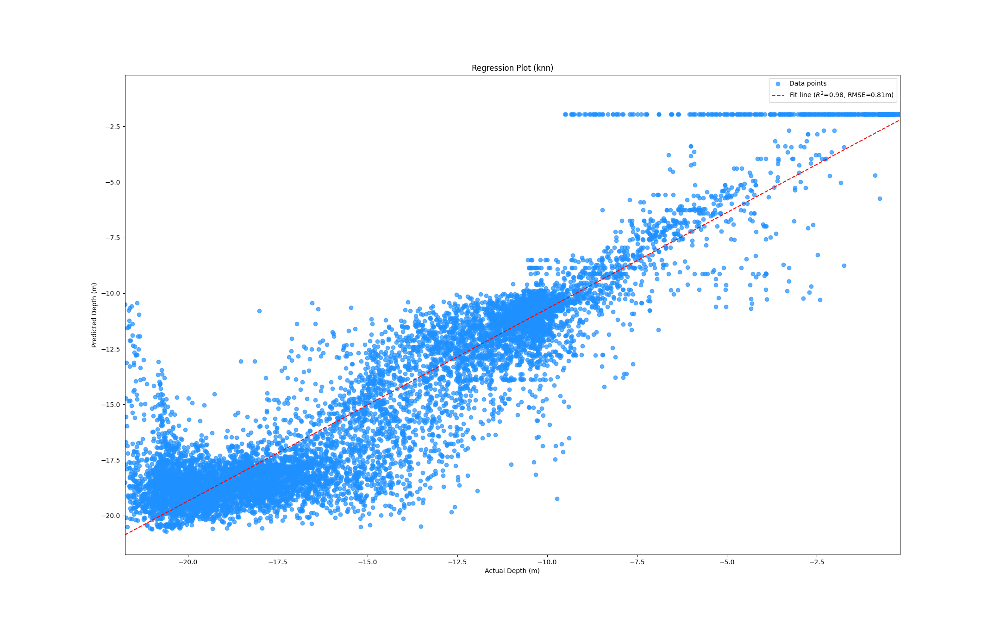
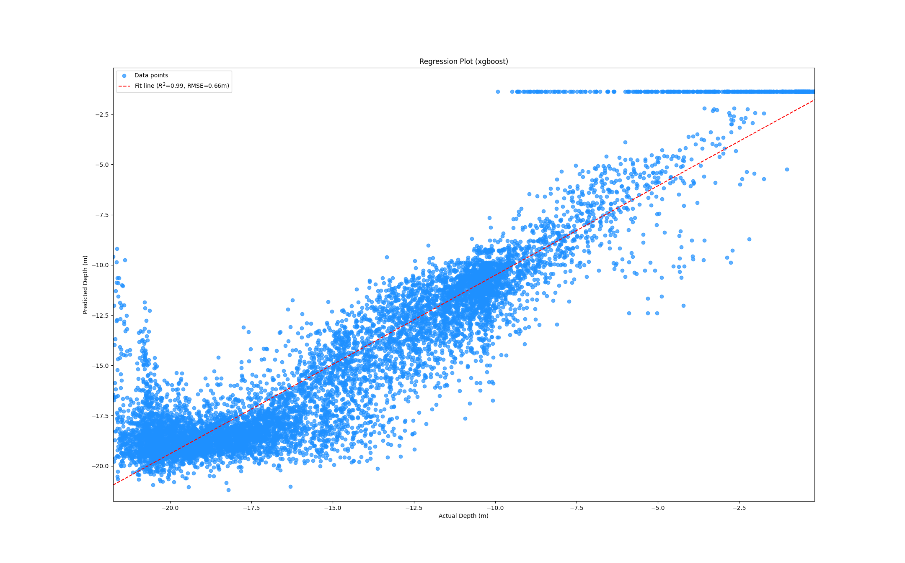
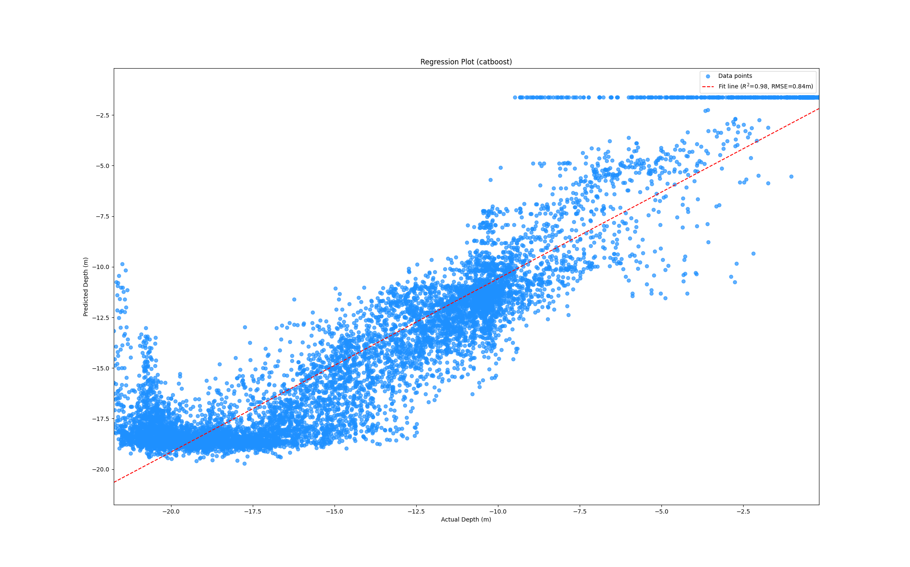

# Machine Learning for Shallow Water Bathymetry

## Methods

1. [Random Forest](1randomforest.ipynb) (Documentation: https://scikit-learn.org/stable/modules/generated/sklearn.ensemble.RandomForestRegressor.html)
2. [Decision Tree](2decisiontree.ipynb) (Documentation: https://scikit-learn.org/stable/modules/generated/sklearn.tree.DecisionTreeRegressor.html)
3. [Support Vector Machine](3svm.ipynb) (Documentation: https://scikit-learn.org/stable/modules/generated/sklearn.svm.SVR.html)
4. [PLS Regression](4pls.ipynb) (Documentation: https://scikit-learn.org/stable/modules/generated/sklearn.cross_decomposition.PLSRegression.html)
5. [K-Nearest Neighbors](5knn.ipynb) (Documentation: https://scikit-learn.org/stable/modules/generated/sklearn.neighbors.KNeighborsRegressor.html)
6. [XGBoost](6xgboost.ipynb) (Documentation: https://xgboost.readthedocs.io/en/stable/python/python_api.html#xgboost.XGBRegressor)
7. [CatBoost](7catboost.ipynb) (Documentation: https://catboost.ai/en/docs/concepts/python-reference_catboostregressor)
8. [GUI](GUI_Interface4imgs.py) (**QUICK START**)

## Data

- Spectral (7 bands, .hdr file + .dat file)
- Depth (1 channel, .hdr file + .dat file)

## Interface

| Image / Description | Image / Description |
| --- | --- |
|  |  |
| The user interface of the application. | The predicted depth fit line using the Random Forest model. |
|  |  |
| The predicted depth fit line using the Decision Tree model. | The predicted depth fit line using the Support Vector Machine model. |
|  |   |
| The predicted depth fit line using the PLS Regression model. | The predicted depth fit line using the K-Nearest Neighbors model.  |
|  |  |
| The predicted depth fit line using the XGBoost model. | The predicted depth fit line using the CatBoost model. |
